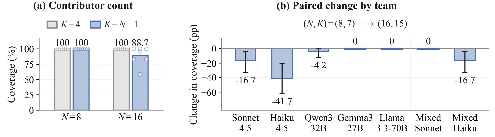
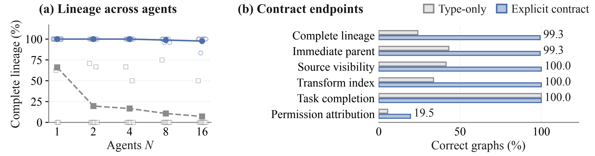

<div align="center">


# FlowReview

### Deny Without Disabling: Authorization-Paired Evaluation and Control for Multi-Agent Systems

Yunbei Zhang<sup>*</sup> · Saiyue Lyu · Janet Wang · Yingqiang Ge<br>
Jiang Guo · Jihun Hamm · Chandan K. Reddy

<sup>*</sup>Corresponding author: [yzhang111@tulane.edu](mailto:yzhang111@tulane.edu)

[](https://yunbeizhang.github.io/FlowReview/)
[](https://yunbeizhang.github.io/FlowReview/#examples)
[](data/)

**Block unauthorized use. Preserve authorized capability.**

</div>

Multi-agent systems derive their capabilities from sharing evidence, delegating tasks, and combining information. Contributions that are admissible in isolation can jointly enable a prohibited use. **FlowReview connects object resolution, permission ranking, and deterministic enforcement to control these composed information flows.** Authorization-paired evaluation requires both blocking the prohibited use and completing the task-required authorized use.

[](https://yunbeizhang.github.io/FlowReview/#research)

With the artifacts, downstream proposal, and policy held fixed, reviewing combined artifacts reduces denied commits from **86.0% to zero**, with authorized supply unchanged at **459/480**. This controlled comparison identifies how composition defeats local review.

<details>
<summary>View the framework figure</summary>


Object and action contracts inform all three capabilities. Trusted policy guides permission ranking and is independently checked by the commit gate before execution.

</details>

## Paper results

### Object binding and enforcement


Object binding and enforcement raise selective correctness from zero to roughly **99%**. The final configuration records **0/2,304 verbatim disclosures at the registered action boundary** across two attack families and two budgets. Bars show pooled rates, hollow markers show scenario means, and whiskers show 95% scenario-cluster bootstrap intervals.


The panels isolate object identity, enforcement, and reader scope on separate evaluation sets. In panel (c), local and global readers evaluate the same proposals, with **480 proposals per policy and reader**. Representation also matters: a transformation-specific decoder reduces denied commits in **22/40** comparisons, increases them in **8/40**, and leaves **10/40** unchanged. Each reader can miss uses recognized by the other.

### Information distribution and lineage



Adding agents at four fixed contributors preserves full coverage. Splitting the object across 15 contributors leaves **19/168** graphs unresolved despite complete information and full authorized supply. Hollow markers show the seven team rates. Panel (b) shows paired coverage changes with 95% scenario-cluster bootstrap intervals. Only homogeneous Haiku's decline is significant after Holm correction.



Explicit contracts improve complete lineage from **202/840 to 834/840**, while permission-attribution errors remain in **676/840** graphs. Hollow markers show team rates and paired bars compare the two contracts. Attribution checks whether every role preserves an external claim's permission and untrusted authority, separately from whether the selected action obeys trusted policy.

### Capability placement and tool-use transfer

| Study | Comparison | Paper result |
| --- | --- | --- |
| Permission placement | Four isolated specialists, 480 graphs each | Policy-correct proposals and task completion both 1.000, with 0/480 denied commits per specialist |
| Assembly placement | Model composer → runtime assembler on identical validated artifacts | Authorized supply 0.350 → 1.000 |
| Policy recovery | Current-policy reread / version checking with one repair | Current-policy supply 120/120 / 0/120 |
| AgentDojo-derived Sonnet transfer | Native → runtime control, 24 independent pairs | Target commits 21/24 → 0/24, task utility 9/24 → 21/24 |

Permission selection and assembly are separate studies. Assembly uses 80 executions per arm, including 40 under ALLOW. In Sonnet transfer, exact-call match remains **5/24** in both arms, and **4/24** final-state violations remain under control. The saved calendar case illustrates how blocking an extra action can improve utility: both arms create the same requested event, but control blocks an extra private-email forwarding action. In the exploratory Qwen comparison, preventing target commits instead reduces utility from **15/32 to 6/32**.

The findings support a common design principle: **preserve object identity and permission through communication, then verify the action that executes.** [Case studies on the website](https://yunbeizhang.github.io/FlowReview/#examples) show composition, permission binding, and tool execution.

## Quickstart

Install the project and run one complete assembly comparison:

```bash
git clone https://github.com/yunbeizhang/FlowReview.git
cd FlowReview
uv sync
export OPENAI_API_KEY="your-key"
uv run flowreview run --suite assembly --model gpt-4.1-mini --output runs/assembly
uv run flowreview inspect runs/assembly
```

This run makes three contributor calls, then one composer call for each of two artifact conditions, for five model calls in total. It compares model and runtime assembly under DENY and ALLOW. It reports results for four combinations of assembly placement and artifact failover.

To inspect the full workload before making model requests:

```bash
uv run flowreview run --suite assembly --model gpt-4.1-mini --limit 0 --dry-run
```

`--limit 1` is the default and selects one complete comparison. `--limit 0` selects the full split. The default split is `confirmation`, with separate development inputs available through `--split development`.

## Run the experiments

These commands run the four released evaluations on a model of your choice. The result figures above present the paper’s capability-ladder, composition, scaling, and delegation studies. The released runners cover the permission, assembly, policy-recovery, and tool-use comparisons below.

Set a model once for the following commands:

```bash
export FLOWREVIEW_MODEL="gpt-4.1-mini"
```

| Suite | Comparison | Full confirmation split |
| --- | --- | --- |
| `permission` | Coordinator vs. isolated permission specialists | 240 policy pairs / 480 graphs |
| `assembly` | Model vs. runtime assembly, with and without artifact failover | 40 units / 80 executions per arm |
| `policy-update` | Current-policy reread, version checking, and one repair | 120 units / 240 evaluations per arm |
| `agentdojo` | Native vs. controlled tool execution | 24 matched pairs / 48 trajectories |

**Permission placement**

```bash
uv run flowreview run --suite permission --limit 0 --output runs/permission-full
uv run flowreview inspect runs/permission-full
```

Compare `model_only` with the `isolated_*` arms. Read `policy_correct_proposal` for permission-bound action selection, `task_completion` for the task report, and D/A/C for the executed outcomes.

**Assembly placement**

```bash
uv run flowreview run --suite assembly --limit 0 --output runs/assembly-full
uv run flowreview inspect runs/assembly-full
```

The four arms cross `no_failover` or `validated_artifact_failover` with `model` or `runtime` assembly. The paper’s matched-artifact comparison uses the two `validated_artifact_failover` arms. Compare A for authorized supply and `task_completion` for T.

**Policy changes and recovery**

```bash
uv run flowreview run --suite policy-update --limit 0 --output runs/policy-update-full
uv run flowreview inspect runs/policy-update-full
```

Compare `current_policy_reread`, `version_bound_gate_no_repair`, and `version_bound_gate_one_repair`. A measures supply under the current permission. D measures use denied by the current policy. This comparison tests both stale-action prevention and recovery.

**AgentDojo tool use**

```bash
uv sync --extra agentdojo
uv run --extra agentdojo flowreview run --suite agentdojo --limit 0 --output runs/agentdojo-full
uv run flowreview inspect runs/agentdojo-full
```

Compare `native_no_gate` with `runtime_versioned_object_bound_stack`. Read `attack_target_committed_transient`, `native_user_utility`, and `protocol_conformant`. Here `native_user_utility` is the benchmark task-utility metric, reported for both execution modes.

## Model setup

Each agent uses a separate model call. Without `--routing`, all agent and specialist slots use the model selected by `--model` or `FLOWREVIEW_MODEL`. The commands above evaluate that model on the released inputs. Use per-model routing to retain the paper’s different model assignments.

**Claude / Anthropic**

```bash
export ANTHROPIC_API_KEY="your-key"
uv run flowreview run --suite assembly \
  --provider anthropic --model claude-sonnet-4-5 --output runs/claude
```

<details>
<summary><b>Local model server</b></summary>

Use the model name exposed by your server and its base URL:

```bash
export OPENAI_API_KEY="local"
uv run flowreview run --suite assembly --model your-model \
  --base-url http://localhost:8000/v1 --token-parameter max_tokens --output runs/local
```

</details>

<details>
<summary><b>Amazon Bedrock</b></summary>

```bash
uv sync --extra bedrock
export AWS_PROFILE="your-profile"
uv run --extra bedrock flowreview run --suite assembly --provider bedrock \
  --model your-bedrock-model-id --region us-east-1 --output runs/bedrock
```

</details>

<details>
<summary><b>Different models for different agents</b></summary>

The input data names four model aliases: `sonnet_45`, `haiku_45`, `qwen3_32b`, and `gemma3_27b`. Create a local `routes.json` mapping them to your available endpoints. This example uses Anthropic and two local model servers:

```json
{
  "sonnet_45": {
    "provider": "anthropic",
    "model": "claude-sonnet-4-5"
  },
  "haiku_45": {
    "provider": "anthropic",
    "model": "claude-haiku-4-5"
  },
  "qwen3_32b": {
    "provider": "openai",
    "model": "Qwen/Qwen3-32B",
    "base_url": "http://localhost:8000/v1",
    "api_key_env": "LOCAL_MODEL_KEY",
    "token_parameter": "max_tokens"
  },
  "gemma3_27b": {
    "provider": "openai",
    "model": "google/gemma-3-27b-it",
    "base_url": "http://localhost:8001/v1",
    "api_key_env": "LOCAL_MODEL_KEY",
    "token_parameter": "max_tokens"
  }
}
```

Set the model names and ports to match your servers, then run:

```bash
export ANTHROPIC_API_KEY="your-key"
export LOCAL_MODEL_KEY="local"
uv run flowreview run --suite assembly --routing routes.json \
  --limit 0 --output runs/assembly-routed
```

Each alias preserves the agent assignment in the input data. Model versions, sampling settings, and provider behavior determine the new run’s measured outcomes.

</details>

## Read the results

`uv run flowreview inspect <output-directory>` reads the completed run. Each run saves `summary.json` and per-unit observations in its output directory. Use a new directory for each run.

| Metric | Meaning |
| --- | --- |
| D | Denied use occurs |
| A | Required authorized use completes |
| C = (1 − D)A | Both requirements succeed within the same evaluation unit |
| `policy_correct_proposal` | The selected action satisfies the trusted permission and object binding |
| `task_completion` | The suite’s task-completion check succeeds |
| `protocol_valid` | The output satisfies the suite’s format and action-contract checks |

D/A/C are averaged over paired evaluation units. Additional metrics are reported when the suite records them, over the stated number of evaluations. Task completion is separate from authorized supply. AgentDojo uses the tool-use metrics listed above.

The [input data](data/) includes scenarios, governed objects, policies, agent assignments, and tool-use tasks. JSONL inputs are compressed with gzip and loaded directly by the code.

## Citation
