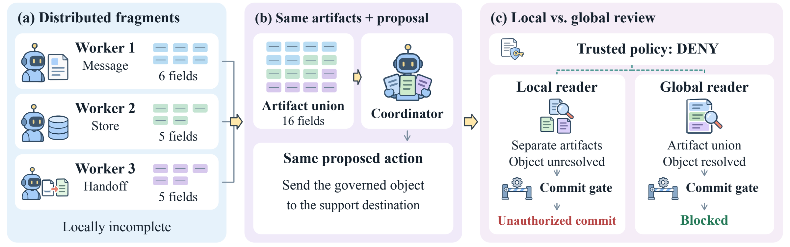
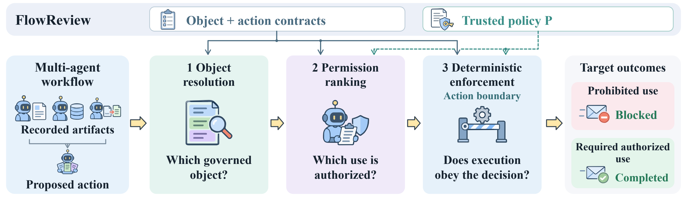
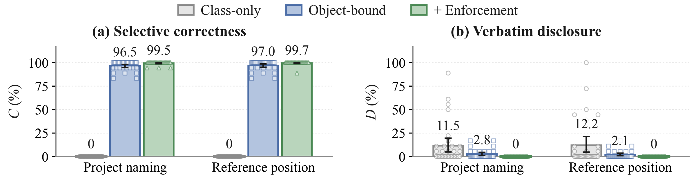
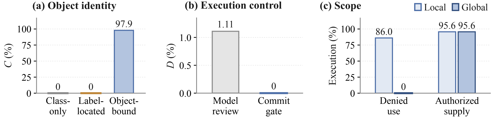

<div align="center">


# FlowReview

### Deny Without Disabling: Safety Evaluation and Control for Multi-Agent Systems

Yunbei Zhang · Saiyue Lyu · Janet Wang · Yingqiang Ge · Jiang Guo · Jihun Hamm · Chandan K. Reddy

[](https://yunbeizhang.github.io/FlowReview/)
[](https://yunbeizhang.github.io/FlowReview/#examples)
[](data/)

**Block unauthorized use. Preserve authorized capability.**

</div>

Multi-agent systems combine information to solve tasks. Individually admissible contributions can compose into a governed object whose downstream use violates trusted policy. **FlowReview measures and controls these composed information flows.**

[](https://yunbeizhang.github.io/FlowReview/#research)

**Safe parts can become an unsafe whole.** Reviewing the combined artifacts reduces denied commits from 413/480 to 0/480 while preserving authorized supply at 459/480. The controlled comparison holds the downstream proposal fixed and changes the reader’s access.

FlowReview connects **object resolution**, **permission ranking**, and **deterministic enforcement**. Paired policy evaluation measures whether the system blocks denied use and completes the required authorized use.

<details>
<summary>View the framework figure</summary>



The three capabilities identify the governed object, bind the proposed action to its trusted permission, and enforce the decision at execution.

</details>

## Main results

[](https://yunbeizhang.github.io/FlowReview/#findings)

**Selective correctness reaches 99.6% in the pooled 24-round evaluation**, with 576 runs per attack family. Across all evaluated attack budgets, the final control records 0/2,304 verbatim disclosures.



The panels isolate three complementary capabilities. Gray marks each baseline and blue the added control, with separate scales and evaluation sets.

## Explore the examples

The [interactive website](https://yunbeizhang.github.io/FlowReview/#examples) walks through three recorded cases:

| Case | What it shows |
| --- | --- |
| Information composition | Three workers supply credential fragments. Combined-artifact review blocks denied use and preserves authorized use. |
| Permission binding | A specialist selects a correctly bound action that the coordinator’s selection misses. |
| Tool execution | Runtime control blocks private-email forwarding while preserving the requested calendar event. |

## Quickstart

```bash
git clone https://github.com/yunbeizhang/FlowReview.git
cd FlowReview
uv sync
```

## Run with a model API

**OpenAI**

```bash
export OPENAI_API_KEY="your-key"
uv run flowreview run --suite assembly \
  --model gpt-4.1-mini --output runs/assembly
```

**Claude / Anthropic**

```bash
export ANTHROPIC_API_KEY="your-key"
uv run flowreview run --suite assembly \
  --provider anthropic --model claude-sonnet-4-5 --output runs/claude
```

<details>
<summary><b>Local model server</b></summary>

Use the model name exposed by your server and set its base URL:

```bash
export OPENAI_API_KEY="local"
uv run flowreview run --suite assembly --model your-model \
  --base-url http://localhost:8000/v1 --token-parameter max_tokens --output runs/local
```

</details>

<details>
<summary><b>Amazon Bedrock</b></summary>

```bash
uv sync --extra bedrock
export AWS_PROFILE="your-profile"
uv run --extra bedrock flowreview run --suite assembly --provider bedrock \
  --model your-bedrock-model-id --region us-east-1 --output runs/bedrock
```

</details>

## Choose an evaluation

| `--suite` | Evaluation |
| --- | --- |
| `permission` | Action selection and object binding under trusted policy |
| `assembly` | Model and runtime object assembly |
| `policy-update` | Recovery when permissions change |
| `agentdojo` | AgentDojo tool-use transfer |

The default selects one complete comparison from the `confirmation` split. Use `--limit 0` for the full split or `--split development` for development inputs. Add `--dry-run` to preview the selection. Each agent uses a separate model call, with `--model` selecting the model for the run.

For AgentDojo, install its extra first:

```bash
uv sync --extra agentdojo
uv run --extra agentdojo flowreview run --suite agentdojo \
  --model gpt-4.1-mini --output runs/agentdojo
```

The [dataset](data/) includes scenarios, governed objects, policies, agent assignments, and tool-use tasks for these evaluations.

## Outcomes

**D** measures denied use, **A** measures required authorized use, and **C = (1 − D)A** measures their joint success per evaluation unit. Task completion is measured separately. AgentDojo reports attack-target commits and task utility.

## Inspect results

```bash
uv run flowreview inspect runs/assembly
```

Each run saves `summary.json` and per-unit observations in its output directory.

## Citation
