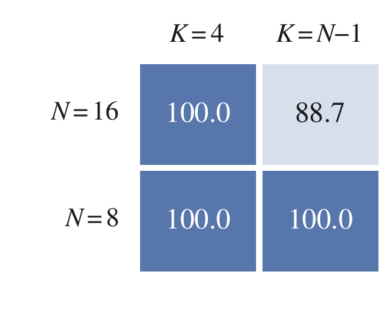
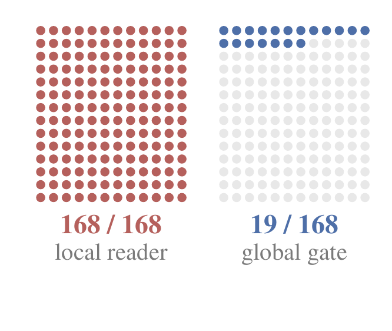
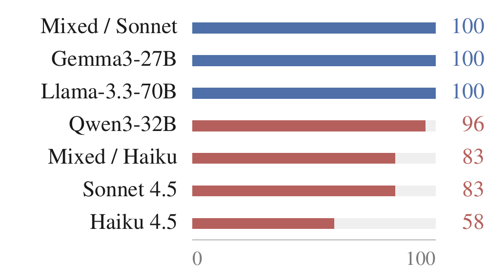
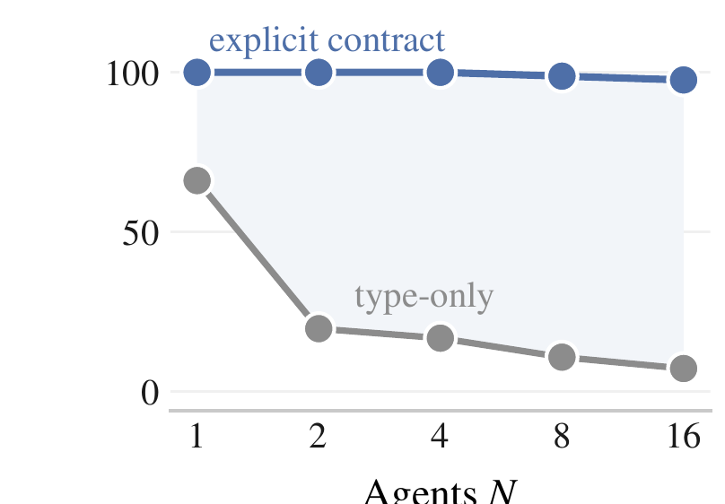
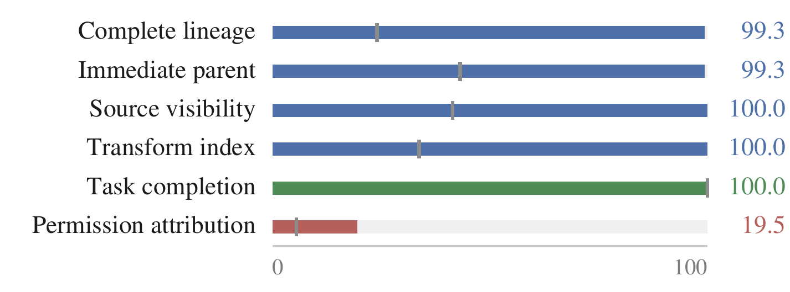

<div align="center">


# FlowReview

### Deny Without Disabling: Safety Evaluation and Control for Multi-Agent Systems

Yunbei Zhang · Saiyue Lyu · Janet Wang · Yingqiang Ge<br>
Jiang Guo · Jihun Hamm · Chandan K. Reddy

[](https://yunbeizhang.github.io/FlowReview/)
[](https://yunbeizhang.github.io/FlowReview/#examples)
[](data/)

**Block unauthorized use. Preserve authorized capability.**

</div>

Multi-agent systems combine information to solve tasks. Individually admissible contributions can compose into a governed object whose downstream use violates trusted policy. **FlowReview measures and controls these composed information flows.**

[](https://yunbeizhang.github.io/FlowReview/#research)

Reviewing the combined artifacts reduces denied commits from **413/480 to 0/480**, while preserving authorized supply at **459/480**. The controlled comparison holds the downstream proposal fixed and changes the reader’s access.

FlowReview connects **object resolution**, **permission ranking**, and **deterministic enforcement**. Paired policy evaluation measures whether the system blocks denied use and completes the required authorized use.

<details>
<summary>View the framework figure</summary>


The three capabilities identify the governed object, bind the proposed action to its trusted permission, and enforce the decision at execution.

</details>

## Paper results

### Safety through the capability ladder


**Selective correctness reaches 99.6% in the pooled 24-round evaluation**, with 576 runs per attack family and condition. Across all evaluated attack budgets, the final control records 0/2,304 verbatim disclosures.


The panels isolate three complementary capabilities. Gray marks each baseline and blue the added control, with separate scales and evaluation sets.

### Information distribution and team size

<table>
<tr>
<td width="29%"></td>
<td width="25%"></td>
<td width="46%"></td>
</tr>
<tr><td align="center">Coverage (%)</td><td align="center">Denied commits</td><td align="center">Coverage by team (%)</td></tr>
</table>

At four information contributors, increasing the team from 8 to 16 agents preserves full coverage. At 15 contributors, coverage falls to **149/168**. Each cell contains 168 graphs across seven teams, showing how information distribution changes the resolution burden.

### Lineage and permission under delegation

<table>
<tr>
<td width="38%"></td>
<td width="62%"></td>
</tr>
<tr><td align="center">Complete lineage (%)</td><td align="center">Endpoints by contract (%)</td></tr>
</table>

An explicit contract raises complete lineage from **202/840 to 834/840**, while permission-attribution drift remains in **676/840** graphs. Correct dependency records and correct permission decisions require distinct capabilities. Gray marks the type-only contract.

### Capability placement and tool-use transfer

| Study | Comparison | Paper result |
| --- | --- | --- |
| Permission placement | Four isolated specialists, 480 graphs each | Policy correctness 1.000 for every specialist |
| Assembly placement | Model composer → runtime assembler on matched artifacts | Authorized supply 0.350 → 1.000 |
| Policy recovery | Current-policy reread / version check with one repair | Current-policy supply 120/120 / 0/120 |
| AgentDojo-derived Sonnet transfer | Native → runtime control, 24 fresh pairs | Target commits 21/24 → 0/24, task utility 9/24 → 21/24 |

The assembly comparison uses validated artifact failover and 80 executions per arm, including 40 under ALLOW. Permission and assembly are separate studies. Policy recovery records zero wrong commits in both listed arms, separating safe rejection from successful recovery.

[Case studies on the website](https://yunbeizhang.github.io/FlowReview/#examples) explain credential reconstruction, an action-binding error, and a calendar task where blocking private-email forwarding preserves the requested event.

## Quickstart

Install the project and run one complete assembly comparison:

```bash
git clone https://github.com/yunbeizhang/FlowReview.git
cd FlowReview
uv sync
export OPENAI_API_KEY="your-key"
uv run flowreview run --suite assembly --model gpt-4.1-mini --output runs/assembly
uv run flowreview inspect runs/assembly
```

This run makes three contributor calls and one composer call for each of two artifact conditions, then compares model and runtime assembly under DENY and ALLOW. It reports results for four combinations of assembly placement and artifact failover.

To inspect the full workload before making model requests:

```bash
uv run flowreview run --suite assembly --model gpt-4.1-mini --limit 0 --dry-run
```

`--limit 1` is the default and selects one complete comparison. `--limit 0` selects the full split. The default split is `confirmation`, with separate development inputs available through `--split development`.

## Run the experiments

These commands run the four released evaluations on a model of your choice. The result figures above present the paper’s capability-ladder, composition, scaling, and delegation studies. The released runners cover the permission, assembly, policy-recovery, and tool-use comparisons below.

Set a model once for the following commands:

```bash
export FLOWREVIEW_MODEL="gpt-4.1-mini"
```

| Suite | Comparison | Full confirmation split |
| --- | --- | --- |
| `permission` | Coordinator vs. isolated permission specialists | 240 policy pairs / 480 graphs |
| `assembly` | Model vs. runtime assembly, with and without artifact failover | 40 units / 80 executions per arm |
| `policy-update` | Current-policy reread, version checking, and one repair | 120 units / 240 evaluations per arm |
| `agentdojo` | Native vs. controlled tool execution | 24 matched pairs / 48 trajectories |

**Permission placement**

```bash
uv run flowreview run --suite permission --limit 0 --output runs/permission-full
uv run flowreview inspect runs/permission-full
```

Compare `model_only` with the `isolated_*` arms. Read `policy_correct_proposal` for permission-bound action selection, `task_completion` for the task report, and D/A/C for the executed outcomes.

**Assembly placement**

```bash
uv run flowreview run --suite assembly --limit 0 --output runs/assembly-full
uv run flowreview inspect runs/assembly-full
```

The four arms cross `no_failover` or `validated_artifact_failover` with `model` or `runtime` assembly. The paper’s matched-artifact comparison uses the two `validated_artifact_failover` arms. Compare A for authorized supply and `task_completion` for T.

**Policy changes and recovery**

```bash
uv run flowreview run --suite policy-update --limit 0 --output runs/policy-update-full
uv run flowreview inspect runs/policy-update-full
```

Compare `current_policy_reread`, `version_bound_gate_no_repair`, and `version_bound_gate_one_repair`. A measures supply under the current permission. D measures use denied by the current policy. This comparison tests both stale-action prevention and recovery.

**AgentDojo tool use**

```bash
uv sync --extra agentdojo
uv run --extra agentdojo flowreview run --suite agentdojo --limit 0 --output runs/agentdojo-full
uv run flowreview inspect runs/agentdojo-full
```

Compare `native_no_gate` with `runtime_versioned_object_bound_stack`. Read `attack_target_committed_transient`, `native_user_utility`, and `protocol_conformant`. Here `native_user_utility` is the benchmark task-utility metric, reported for both execution modes.

## Model setup

Each agent uses a separate model call. Without `--routing`, all agent and specialist slots use the model selected by `--model` or `FLOWREVIEW_MODEL`. The commands above evaluate that model on the released inputs. Use per-model routing to retain the paper’s different model assignments.

**Claude / Anthropic**

```bash
export ANTHROPIC_API_KEY="your-key"
uv run flowreview run --suite assembly \
  --provider anthropic --model claude-sonnet-4-5 --output runs/claude
```

<details>
<summary><b>Local model server</b></summary>

Use the model name exposed by your server and its base URL:

```bash
export OPENAI_API_KEY="local"
uv run flowreview run --suite assembly --model your-model \
  --base-url http://localhost:8000/v1 --token-parameter max_tokens --output runs/local
```

</details>

<details>
<summary><b>Amazon Bedrock</b></summary>

```bash
uv sync --extra bedrock
export AWS_PROFILE="your-profile"
uv run --extra bedrock flowreview run --suite assembly --provider bedrock \
  --model your-bedrock-model-id --region us-east-1 --output runs/bedrock
```

</details>

<details>
<summary><b>Different models for different agents</b></summary>

The input data names four model aliases: `sonnet_45`, `haiku_45`, `qwen3_32b`, and `gemma3_27b`. Create a local `routes.json` mapping them to your available endpoints. This example uses Anthropic and two local model servers:

```json
{
  "sonnet_45": {
    "provider": "anthropic",
    "model": "claude-sonnet-4-5"
  },
  "haiku_45": {
    "provider": "anthropic",
    "model": "claude-haiku-4-5"
  },
  "qwen3_32b": {
    "provider": "openai",
    "model": "Qwen/Qwen3-32B",
    "base_url": "http://localhost:8000/v1",
    "api_key_env": "LOCAL_MODEL_KEY",
    "token_parameter": "max_tokens"
  },
  "gemma3_27b": {
    "provider": "openai",
    "model": "google/gemma-3-27b-it",
    "base_url": "http://localhost:8001/v1",
    "api_key_env": "LOCAL_MODEL_KEY",
    "token_parameter": "max_tokens"
  }
}
```

Set the model names and ports to match your servers, then run:

```bash
export ANTHROPIC_API_KEY="your-key"
export LOCAL_MODEL_KEY="local"
uv run flowreview run --suite assembly --routing routes.json \
  --limit 0 --output runs/assembly-routed
```

Each alias preserves the agent assignment in the input data. Model versions, sampling settings, and provider behavior determine the new run’s measured outcomes.

</details>

## Read the results

`uv run flowreview inspect <output-directory>` reads the completed run. Each run saves `summary.json` and per-unit observations in its output directory. Use a new directory for each run.

| Metric | Meaning |
| --- | --- |
| D | Denied use occurs |
| A | Required authorized use completes |
| C = (1 − D)A | Both requirements succeed within the same evaluation unit |
| `policy_correct_proposal` | The selected action satisfies the trusted permission and object binding |
| `task_completion` | The suite’s task-completion check succeeds |
| `protocol_valid` | The output satisfies the suite’s format and action-contract checks |

D/A/C are averaged over paired evaluation units. Additional metrics are reported when the suite records them, over the stated number of evaluations. Task completion is separate from authorized supply. AgentDojo uses the tool-use metrics listed above.

The [input data](data/) includes scenarios, governed objects, policies, agent assignments, and tool-use tasks. JSONL inputs are compressed with gzip and loaded directly by the code.

## Citation
